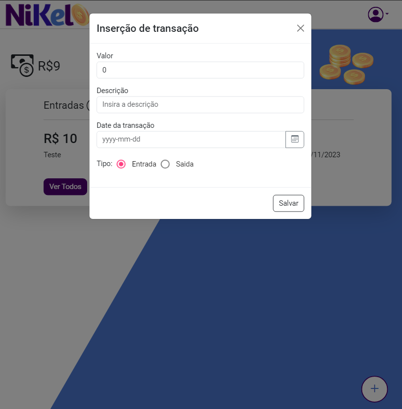
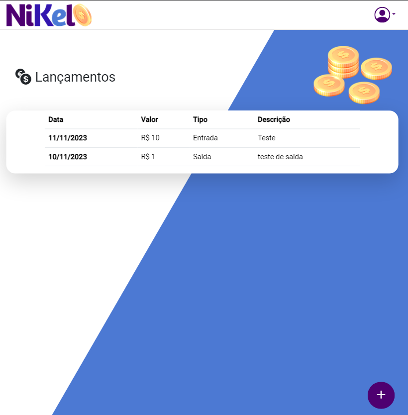

<div align="center">
  <h1 align="center">
 
  <br />
  # Nikel Clone with Angular
</h1>
<p align="center">
    
    
</p>
</div>

## Preview

<div align="center">
    <a href="#">
      
      
      
    </a>
</div>

## Descrição
Este projeto é um clone da aplicação <a href="https://github.com/M-Felipe/nikel">Nikel</a> desenvolvida originalmente em HTML, Javascript e CSS como parte de um curso da GrowDev. É uma plataforma de histórico de transações de entrada e saída, agora recriada utilizando Angular e Local Storage.

## Funcionalidades
- [x] Totalmente Componentizado com Angular
- [x] Desenvolvido com Angular
- [ ] Implementação com Firebase (em breve)
- [ ] Edição de Transações
- [ ] Novas Atualizações em breve

## Tecnologias & Técnicas

Este projeto foi desenvolvido utilizando:
-   [Angular](https://angular.io)

## Como Rodar

1. Instale as dependências:

    ```bash
    npm install
    ```

2. Navegue até o diretório do projeto:

    ```bash
    cd Nikel---Angular
    ```

3. Execute o servidor de desenvolvimento:

    ```bash
    ng serve
    ```

4. Acesse a aplicação:

    ```bash
    http://localhost:4200/
    ```

A aplicação rodará em modo de desenvolvimento e recarregará automaticamente ao detectar mudanças nos arquivos de origem.

## Autor

| [<br><sub>Marcos Felipe</sub>](https://github.com/M-Felipe) |
| :---------------------------------------------------------------------------------------------------------------------------------------: |
| [LinkedIn](https://www.linkedin.com/in/marcos-felipe-de-freitas-batista-02b745183/) |

---
