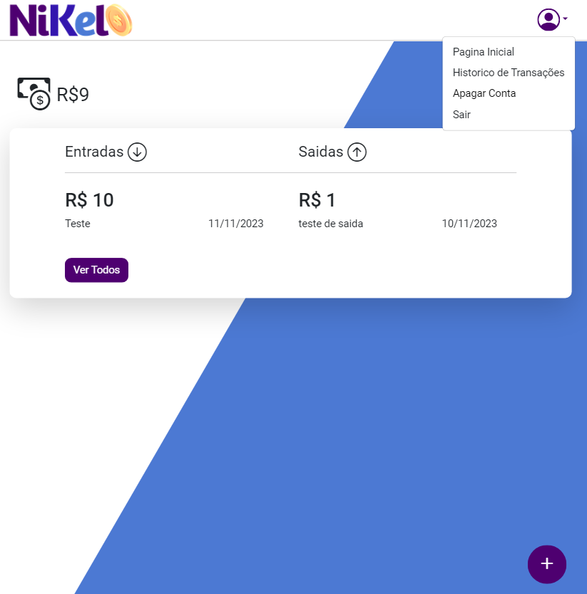

# Project - Nikel Clone with Angular
<div align="center">
<p align="center">
 <!--
   
 -->
  <!--
    
  -->
    
   	
  </p>
</div>

## Preview 

<div align="center">
  	<a href="#">
      
  	</a>
</div>

## Features
- [x] Fully Component With Angular
- [x] Developed With Angular
- [ ] Developed With Firebase
- [ ] Updates coming soon

## Technologies & Techniques

This project was developed with the following technologies:
-   [Angular](https://angular.io)

## Building

Run `ng serve` for a dev server. Navigate to `http://localhost:4200/`. The application will automatically reload if you change any of the source files.

## Usage

📦 1. Install dependencys

```bash
$ npm install
```

```bash
$ cd Nikel---Angular
```

🔧 3. Run the script

```bash
$ ng serve
```

🌐 4. Navigate to

```bash 
 http://localhost:4200/
```
Runs the app in the development mode.<br/>

## Editor

| [<br><sub>Marcos Felipe</sub>](https://github.com/M-Felipe) |
| :---------------------------------------------------------------------------------------------------------------------------------------: |
|                                             [Linkedin](https://www.linkedin.com/in/marcos-felipe-de-freitas-batista-02b745183/)                                             |

---
